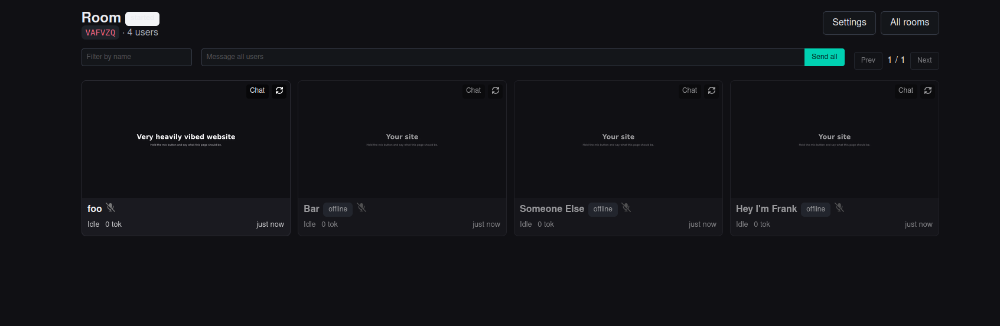
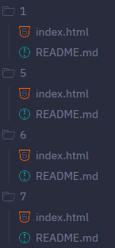
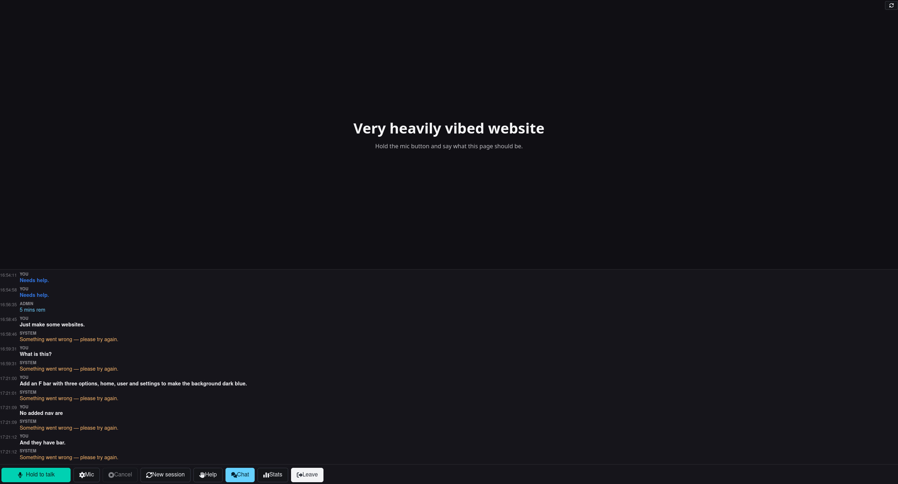

# beevibe

A voice-driven web app for **closed-room events**. An admin opens rooms and creates users; each
user gets a private static website that a per-user LLM **agent** edits in response to voice
prompts. The admin watches every user from a live grid of rendered previews.

Intended for small vibecoding workshops with multiple people in a single room giving call center vibes.

## Screenshots

Admin overview gives a quick dashboard of all users, what their website looks like, what their status is and what their token usage is.



Every user receives a sandboxed subdirectory with a static website that the agent edits in response to voice prompts. Admin's can define a custom base template for the subdirectory, as well as reset a user's files if the agent makes a mess of them.



Participants can solely interact with the agent through voice prompts. Voice-to-text misunderstood you? Tough luck! Cancel your query or try and rephrase it. Any changes to the website are pushed directly to the user via an iframe. Of course, it can also be visited directly.



---

## Layout

| Path                                 | What                                                                        |
| ------------------------------------ | --------------------------------------------------------------------------- |
| `cmd/beevibe/`                       | backend: HTTP + WebSocket, rooms, users, static sites, STT, agents          |
| `cmd/beevibe-renderer/`              | preview renderer service (headless Chromium → WebP)                         |
| `internal/`                          | backend packages (`core`, `agent`, `files`, `stt`, `preview`, `httpapi`, …) |
| `web/`                               | SolidJS + Vite SPA, built to `web/dist` and embedded in the binary          |
| `third_party/whisper.cpp`, `models/` | vendored STT engine and model (both gitignored, fetched by recipes)         |

## Local Development

Prerequisites: the toolchain is pinned in [`mise.toml`](mise.toml) — run `mise install` to get Go
1.27, Node 26, goose, sqlc and just. You also need `cmake` and `git` (to build whisper.cpp),
`curl`, and Docker (for the preview renderer).

Fetch the two gitignored dependencies once:

```sh
just whisper-lib      # clone + cmake-build the whisper.cpp static libs
just whisper-model    # download models/ggml-base.en.bin (~141 MB)
just web-install      # npm ci in web/
```

Then start the app. Two terminals: the preview renderer, and the app itself.

```sh
# terminal 1 — the preview renderer (headless Chromium + the capture service)
docker run --rm --name beevibe-hs --network host chromedp/headless-shell:latest
CHROMIUM_URL=http://127.0.0.1:9222 PORT=9000 just renderer-run

# terminal 2 — the app
export ADMIN_PASSWORD=devpass     # required
export SESSION_SECRET=devsecret   # required, any random string
export RENDERER_URL=http://127.0.0.1:9000    # where the backend finds the renderer
export APP_URL=http://127.0.0.1:8080         # what the renderer must screenshot

just dev                          # Vite on :5173 + backend on :8080
```

Open <http://localhost:5173>, log in with the admin password, create a room and a few users, then
open a user room with one of the generated tokens. Vite proxies `/api`, `/rooms` and `/ws` to the
backend, so the dev server is same-origin — no extra configuration. `/healthz` and `/readyz` live on
the backend only (<http://localhost:8080/readyz>), since Vite proxies just those three prefixes.

The two URL variables above both default to compose service names (`http://renderer:9000` and
`http://backend:8080`) and must be pointed at loopback for a local run — skip them and the capture
is requested for an unresolvable host, so `GET …/preview` stays `404` and tiles keep the colour
placeholder:

- `RENDERER_URL` is how the backend calls the renderer over HTTP.
- `APP_URL` is the URL the backend puts _inside_ the capture request; the headless browser then has
  to load it, which is why the Chromium container runs with `--network host`.

Notes:

- The backend applies the embedded goose migrations at startup, so `just migrate-up` is only
  needed when you want to inspect or migrate the database with the goose CLI.
- There is no `DEEPSEEK_API_KEY` requirement: the app starts without one and logs an `ERROR` line.
  Agent runs then fail with the canned `Something went wrong — please try again.` message, which is
  enough to exercise the whole prompt → queue → chat path offline.
- `just build` produces `bin/beevibe` and `bin/beevibe-renderer` with `web/dist` embedded;
  `just check` runs the whole gate (sqlc, vet, Go tests, frontend build).
- `docker compose up --build` runs the full stack the way it deploys: app on `:8080`, renderer on
  `:9000`, `./data` as the volume. Compose supplies both URLs as service names, which is the one
  setup that needs no overrides. It writes `./data` as `root`; delete that directory afterwards if a
  later local `just migrate-up` fails with `attempt to write a readonly database`.

Run `just` to list every recipe.
