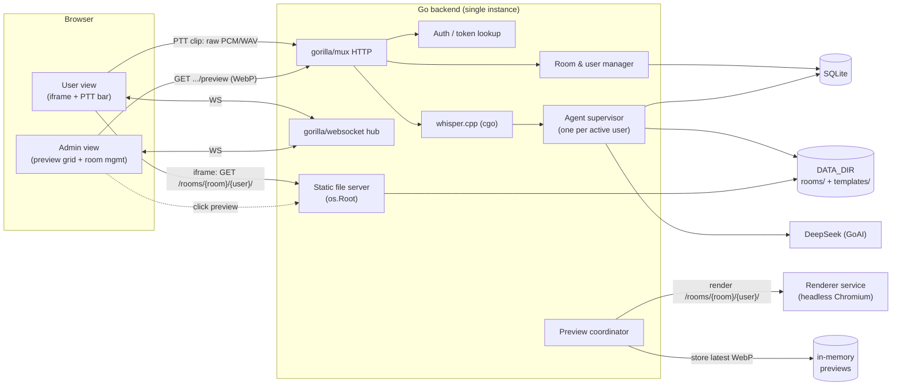

# 2 — Architecture

> **Purpose:** components, storage, serving, previews, protocol pointers, agent design.
> The concrete HTTP and WebSocket shapes live in [api.md](api.md) — **single source of truth**;
> they are not duplicated here.

## 1. Components



## 2. Deployment

- **Single backend instance** + **SQLite** + a data volume, plus a **renderer service**
  (headless Chromium) as a second container: stateless, freely restartable.
- Artifacts: `Dockerfile` (multi-stage: Node builds `dist/`, Go builds with CGO for whisper) and
  `docker-compose.yml` (backend, renderer, data volume). Kubernetes-ready: one backend replica with
  a PVC for `DATA_DIR`, one renderer replica.
- **Frontend assets** are embedded in the binary (`//go:embed all:web/dist`).
- **Health**: `GET /healthz` (liveness) and `GET /readyz` (DB ping + renderer reachability).
- **Shutdown**: SIGTERM → stop accepting, close WebSockets with a normal close frame, mark running
  agent runs `failed`, close the DB; the container terminates cleanly.
- Restart behaviour: rooms, users, messages, agent history and usage survive (SQLite). Runs left
  `queued`/`running` by a crash are marked `failed` at startup; prompt queues are lost. **Signed
  session cookies stay valid across a restart** — nobody is logged out.

## 3. Data model

**Frozen** in [schema.md](schema.md): goose migration `internal/db/migrations/00001_init.sql`,
sqlc queries in `internal/db/queries/*.sql`, generated code in `internal/db/gen` (package
`dbgen`). All three exist and `just generate` succeeds.

| Table            | Purpose                                                            |
| ---------------- | ------------------------------------------------------------------ |
| `rooms`          | state machine + per-room agent model                               |
| `users`          | display name, unique token, optional token limit, cumulative usage |
| `messages`       | the chat log (transcripts, status, admin, system, help)            |
| `agent_messages` | persisted LLM conversation history per user                        |
| `agent_runs`     | one row per prompt (queued/running/finished/cancelled/failed)      |
| `usage_events`   | per-run token usage, fed from GoAI `StepResult.Usage`              |

## 4. Storage layout

```
DATA_DIR/
  beevibe.db                      # SQLite (goose-managed)
  templates/<room_id>/            # optional admin-uploaded subdirectory template
  rooms/<room_id>/<user_id>/
    README.md                     # agent instructions
    index.html                    # site entry point
    ...                           # text-only files the agent creates
```

**Seeding.** A new user's subdirectory — and a bulk "reset subdirectory" — is populated from the
room template when one exists, otherwise from the built-in default `README.md` + `index.html`.
Missing `index.html` / `README.md` are backfilled from the defaults. **Uploading or replacing a
template re-seeds every existing user's subdirectory**, wiping their files and their agent
history: the admin confirms (modal + progress), the whole room is locked meanwhile.

## 5. Static site serving

- `GET /rooms/{roomId}/{userId}/{file...}` — `index.html` by default.
- **Public, no session check** (accepted risk T10). Directory listing disabled.
- Confined with `os.Root`; `..`, absolute paths and symlinks rejected.
- Correct MIME per extension, `.md` as `text/plain`, `X-Content-Type-Options: nosniff`.
- Everything in the directory is public, including `README.md`.
- Loaded in a **sandboxed iframe** (`sandbox="allow-scripts"`, never `allow-same-origin`) — see
  [3-security.md](3-security.md) T1.
- The user's own view reloads the iframe **after each agent tool call**, plus a manual refresh
  button. Writes are atomic (temp + rename), so a reload never sees a half-written file.
- A full **browser** reload loses nothing: the page rebuilds state from the server and the WS
  sends a `hello` snapshot.

## 6. Preview pipeline (admin grid)

The grid shows **images**, not live iframes — this removes the "user site pins the admin's CPU"
risk and makes the grid cheap to page.

Capture triggers (all debounced): **a user is created** (so a seeded default site is previewed
before any run), **a room is started**, **an agent run finishes**, and **a reset / template
re-seed completes**. A capture can also be forced per tile by the admin.

1. A trigger fires → the preview coordinator debounces (`PREVIEW_DEBOUNCE_MS`) and asks the renderer
   to capture that user's URL.
2. The renderer loads `http://backend/rooms/{roomId}/{userId}/` at **1280×720**, executes
   JavaScript, and returns a **WebP**.
3. The backend keeps the **latest WebP per user in memory** and bumps a preview revision.
4. The grid fetches `GET /api/rooms/{id}/users/{uid}/preview` — a **404 means "no usable image"**, so
   the tile falls back to the name tile — and refreshes tiles on `user.update`.
5. Clicking a tile opens the live site **in a new browser tab** (the public URL).

**Renderer policy.** One capture at a time (serial), per-capture timeout **15 s**, **1 vCPU /
1 GiB** per instance, no cookies/credentials, no access to the backend API, `DATA_DIR` or SQLite.
Network access is **not** restricted (accepted risk T14), so pages using a CDN render correctly.
Because capture is serial, a large room's tiles fill progressively after start — placeholder tiles
until each capture lands.

Previews are cached in memory in a **bounded LRU (512 entries ≈ 40 MB)**; evicted users are simply
re-captured on demand. The backend calls the renderer at `RENDERER_URL`; the renderer loads pages
from `APP_URL`.

## 7. Realtime protocol

Two WebSocket endpoints (`/ws/user`, `/ws/admin`), authenticated by the session cookie plus a
strict `Origin` check (T8). Message set: `hello`, `chat.append`, `agent.state`, `site.updated`,
`room.state`, `user.update`, `room.update`, `mic.state`, `help.request`, `agent.cancel`, `ping`.
On reconnect the client re-syncs over REST; the server does not buffer events.

**Exact payloads: [api.md §4](api.md).**

## 8. HTTP API

Login/logout/me · rooms CRUD + lifecycle · users CRUD + kick/cancel/reset + bulk · messages ·
stats · preview + refresh · broadcast · template upload/delete · STT · prompt · context reset.

**Exact request/response bodies: [api.md §3](api.md).**

## 9. LLM agent design

- **One agent per user**, active while the room is `started`; its own conversation context,
  persisted in `agent_messages` and rehydrated on rejoin/restart.
- Built on GoAI with the DeepSeek provider. Model is **per room** (`rooms.model`, default
  `deepseek-flash`); if the provider rejects it, fall back to `deepseek-chat` and log. Tool-loop
  cap `AGENT_MAX_STEPS = 20`.
- **Tools:** `list_files`, `read_file`, `write_file`, `delete_file`, confined to the user's
  subdirectory via `os.Root`. No exec, no shell, no network. Each run's context includes the
  current file listing (names + sizes).
- **File policy:** text-only whitelist `.html/.css/.js/.json/.svg/.md/.txt`; caps 64 files /
  256 KiB per file / 4 MiB per subdirectory (the same caps apply to admin templates). Off-whitelist
  or over-cap writes are rejected back to the model as tool errors.
- **Filenames are case-sensitive** (Linux): the instructions file is exactly **`README.md`**.
- **Context growth:** a sliding window of the last `AGENT_CONTEXT_TURNS` (default 50) turns.
- **Chat voice:** the agent posts **no model-written prose**. The user's chat shows the transcript
  plus automatic per-tool status lines derived from the tool-call hooks. No extra model calls. A run
  that finishes with **zero tool calls** (nothing was understood) is reported by the app as a canned
  `system` message, never as model prose.
- **Unintelligible transcript:** if the instruction is plausible the agent edits; if it is
  unintelligible it MUST make **no changes**, and the app posts the canned "please say that again"
  `system` message.
- **Token accounting:** `StepResult.Usage` accumulates into `usage_events` / `users.tokens_used`.
  The limit is cumulative over input+output tokens and is **unlimited until the admin sets one**;
  once reached, new prompts are blocked until the admin raises the limit or resets usage.
- **Concurrency:** prompts are queued per user and run sequentially; a run is a GoAI call bound to
  a cancellable `context.Context`. At most `MAX_CONCURRENT_RUNS` (default **8**) runs execute
  instance-wide — excess runs wait in their user's queue — and each run is bounded by
  `AGENT_RUN_TIMEOUT_S` (default **120 s**), after which it is marked `failed` and the user is told.
- **Cancellation:** triggered by the user (Cancel button) or the admin (room-settings user list).
  It aborts the running run, clears the queue, records a `system` chat message, counts tokens
  already consumed, and **keeps files already written**. Kick/delete and close/archive reuse the
  same path.
- **New agent session (user-initiated):** from the bottom bar, behind a confirmation modal. It first
  cancels the in-flight run and clears the queue, then hard-deletes that user's `agent_messages`
  rows. Files, the visible chat log (`messages`), `agent_runs` and `usage_events` are untouched, so
  the token budget is unaffected. The next run rebuilds context from the seeded `README.md` plus the
  injected file listing. A `system` chat entry records the reset.
- **Instructions:** each subdirectory is seeded with a `README.md` (from the room template when
  present, otherwise the built-in `internal/seed/README.md`, embedded in the binary) plus a global
  system prompt held in the binary. The seeded README covers the site layout, `index.html` as the
  entry point, relative-path rules, the allowed file types and sizes, the four tools, and the rule
  that the agent cannot ask questions and must implement its best interpretation.
  **The global system prompt text is still ❓Q-AGENT-10.**

## 10. Open questions

See [open-questions.md](open-questions.md) — a single item remains: the agent instruction text.
